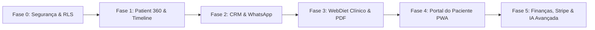

# 🧭 NutrIsa Master Roadmap: Estratégico, Clínico e Técnico

> **Documento Consolidado:** Reúne a visão de produto, matriz de impacto financeiro, regras operacionais do consultório (WebDiet/Google Calendar) e arquitetura de dados/segurança em um único guia de execução.
> 
> 📋 **Checklist Operacional:** Para acompanhar o andamento diário com caixas de seleção (`[ ]` / `[x]`) e próximos passos práticos, veja o arquivo **[Checklist de Tarefas (tasks.md)](tasks.md)**.

---

## 🏛️ 1. Princípios e Modelo de Dados

### Princípios Inegociáveis
* **Paciente no Centro (`patients`):** Toda interação, evolução, mensagem e plano alimentar orbita em torno do paciente.
* **Segurança e RLS Multi-tenant:** Isolamento estrito por clínica/profissional no Supabase. Nenhuma chave secreta no frontend.
* **IA como Co-Piloto (Humano no Controle):** A IA organiza dados, redige mensagens e sugere macros/cardápios, mas **nunca** publica conduta nem diagnostica sem validação humana da Dra. Isabela ou sua equipe.
* **Versionamento Clínico:** Planos alimentares e prescrições não são sobrescritos; mantêm histórico auditável (`rascunho` ➡️ `publicado` ➡️ `arquivado`).

### Modelo Mínimo de Relacionamento
```text
organization (clínica)
  └── professional (Dra. Isabela)
        └── patient (Paciente)
              ├── consultations (Consultas realizadas)
              ├── anamnesis (Histórico, restrições e preferências)
              ├── evaluations (Antropometria, dobras e bioimpedância)
              ├── meal_plan_versions (Cardápios versionados + receitas + lista de compras)
              ├── supplements (Prescrições timbradas em PDF)
              ├── conversations (Log do WhatsApp vinculado ao telefone)
              └── follow_up_tasks (Tarefas de CRM, radar de retorno e SLA)
```

---

## 🎨 2. Mapeamento Operacional da Agenda (WebDiet / Google Calendar)

A agenda já opera com taxonomia de cores utilizada no dia a dia da clínica. A plataforma lê esses parâmetros para disparar automações cirúrgicas.

### A. Cores de Fundo (Tipo / Natureza do Evento)
* 🟣 **Rosa Claro (Presencial):** Atendimento em consultório físico.
* 🔵 **Azul Ciano (Online):** Consulta por videochamada.
* 🟢 **Verde Claro (Primeira Vez):** Primeira consulta / anamnese inicial.
* 🔴 **Vermelho Coral (Retorno):** Reavaliação periódica de plano e bioimpedância.
* ⚫ **Cinza (Pacote):** Paciente com plano contratado (trimestral/semestral).
* 🟣 **Roxo Escuro (Permuta):** Parceria, influenciador ou permuta de divulgação.
* 🔵 **Azul Petróleo (Pessoal):** Compromissos particulares/bloqueios *(o sistema ignora para privacidade)*.
* 🟢 **Verde Escuro (Antropometria):** Sessão exclusiva de pesagem, dobras e medidas.

### B. Cores da Borda (Status de Confirmação)
* ⚪ **Cinza (À Confirmar):** Aguardando confirmação ativa da recepção/paciente.
* 🟢 **Verde Água (Confirmado):** Presença 100% garantida.
* 🔴 **Vermelho (Desmarcado):** Horário cancelado / vago para encaixe.

---

## 🚀 3. Os 6 Pilares do Sistema: O QUE, COMO e POR QUÊ

---

### PILAR 1: Patient 360 & Linha do Tempo Visual de Evolução
* **O QUE FAZER:**
  * Criar a **Ficha Unificada do Paciente** reunindo cadastro, status atual, última consulta, plano vigente e tarefas.
  * Implementar a **Linha do Tempo Visual 360°** com gráficos comparativos de bioimpedância (massa magra em kg, % de gordura, AIC/água intra e extracelular) e comparador de fotos "Antes & Depois" com silhueta e análise de recomposição corporal.
* **COMO FAZER:**
  * **Tabelas do Supabase:** `patients`, `physical_evaluations`, `antropometria`, `evolucao` e Supabase Storage (bucket com políticas RLS para fotos de evolução).
  * **Frontend:** Gráficos com Recharts/Chart.js na aba do paciente, permitindo comparar Consulta 1 vs Consulta 2 vs Consulta 3.
  * **Exportação:** Gerar laudo visual em PDF de 1 página pronto para envio pós-consulta.
* **POR QUE FAZER:**
  * **Impacto Clínico e Financeiro:** Prova visual incontestável de resultados. Reduz o abandono do tratamento e gera renovação imediata de pacotes trimestrais/semestrais.

---

### PILAR 2: CRM de Relacionamento, SLA e WhatsApp Inteligente
* **O QUE FAZER:**
  * Conectar o histórico de conversas (`log_conversas`) à ficha do paciente pelo número de WhatsApp.
  * **Triagem de Alertas Clínicos Urgentes no Sino:** Acender alerta sonoro/visual prioritário quando o paciente relatar sintomas no chat (*"azia"*, *"diarreia"*, *"tontura no treino"*, *"dor no estômago"*, *"creatina acabou"*).
  * **Alerta de SLA de Atendimento (> 1 hora):** Avisar no sino quando uma mensagem de paciente estiver aberta sem resposta da recepção há mais de 60 minutos.
  * **Co-Piloto de Sugestão de Resposta com IA:** Botão *"✨ Sugerir Resposta"* no modal da conversa para gerar respostas acolhedoras e técnicas em 2 segundos para a secretária apenas validar e enviar.
* **COMO FAZER:**
  * **Tabelas do Supabase:** `log_conversas`, `patients`, `tasks`.
  * **Regras de Processamento:** Função Edge / trigger no Supabase que busca palavras-chave de sintomas e gera notificação no sino com prioridade `alta`.
  * **IA (Gemini API):** Endpoint que recebe o contexto recente da conversa + histórico da ficha e devolve a resposta sugerida.
  * **Filtros:** Separação estrita entre mensagens operacionais/administrativas e sintomas clínicos que exigem parecer da Dra. Isabela.
* **POR QUE FAZER:**
  * **Economia de Tempo e Retenção:** Evita que pacientes abandonem o plano por desconforto digestivo não assistido, zera o tempo ocioso da secretária redigindo mensagens repetitivas e garante tempo de resposta de excelência (SLA < 1h).

---

### PILAR 3: Agenda Inteligente, Prevenção de No-Show e Encaixe Rápido
* **O QUE FAZER:**
  * **Prevenção de Faltas Cirúrgica:** Filtrar na agenda do dia seguinte apenas os eventos com **borda Cinza ("À Confirmar")** para disparo do lembrete de presença. Eventos com **borda Verde ("Confirmado")** são poupados.
  * **Mensagens Hiper-Personalizadas pelo Fundo:**
    * *Azul Ciano (Online):* Envia link da videochamada (Google Meet).
    * *Rosa Claro (Presencial):* Envia endereço, mapa e orientações de estacionamento.
    * *Verde Claro (Primeira Vez):* Envia questionário de Anamnese pré-consulta.
    * *Verde Escuro (Antropometria):* Lembra de comparecer com roupa adequada para medições e jejum hídrico.
  * **Gatilho de Encaixe Imediato:** Quando um evento ganha **borda Vermelha ("Desmarcado")**, o sistema notifica a recepção com a lista de espera recomendada para preencher o horário vago.
* **COMO FAZER:**
  * **Tabelas/Integração:** `appointments`, Google Calendar API / webhook WebDiet.
  * **Lógica de Automação:** Cron diário (ex: 18h) consultando eventos de D+1 com filtro `border_color = 'cinza'` gerando lista de disparo no WhatsApp.
* **POR QUE FAZER:**
  * **Impacto no Faturamento:** Zera as horas ociosas e consultas perdidas no consultório. Cada horário vago recuperado representa faturamento direto sem custo adicional.

---

### PILAR 4: WebDiet Clínico, IA de Macros e Prescrição Timbrada
* **O QUE FAZER:**
  * **Cálculo Energético & IA Co-Piloto de Cardápio:** Cruzar a Taxa Metabólica Basal (TMB calculada na bioimpedância) + rotina de treinos + restrições/gostos da Anamnese para sugerir distribuição de macronutrientes (Proteína, Carbo, Gordura) dividida por refeição, com opções de substituições práticas.
  * **Versionamento de Planos Alimentares:** Controle de status (`rascunho`, `publicado`, `arquivado`) com lista de compras automática gerada para a semana.
  * **Gerador Rápido de Prescrição de Suplementos (PDF):** Formulário em 1 clique com checkboxes e dosagens padronizadas pela Dra. Isabela (Creatina, Whey, Ômega-3, Magnésio, etc.), gerando PDF timbrado com CRN e cupons de farmácias de manipulação parceiras.
* **COMO FAZER:**
  * **Tabelas do Supabase:** `plano_alimentar`, `calculo_energetico`, `suplementos`, `anamnese`.
  * **Integração IA:** Prompt estruturado no Gemini com schemas JSON contendo as refeições, gramaturas, substitutos e calorias.
  * **Layout PDF:** Componente React/Print com cabeçalho oficial, dados do paciente, dosagens, modo de uso e assinatura profissional.
* **POR QUE FAZER:**
  * **Economia de Tempo:** Reduz de 30 a 40 minutos o tempo gasto na montagem manual de cardápios e receitas pós-consulta, permitindo atender mais pacientes ou focar na consulta humanizada. Abre canal de monetização com farmácias parceiras.

---

### PILAR 5: Portal Web Interativo do Paciente (Link PWA Sem Senha Complexa)
* **O QUE FAZER:**
  * Substituir o envio de PDFs soltos no WhatsApp por um link seguro e elegante (ex: `nutrisa.app/p/[slug-unico]`).
  * O paciente instala como aplicativo no celular (PWA) e acessa:
    1. Cardápio vigente com fotos, receitas e lista de compras inteligente.
    2. Laudo comparativo de bioimpedância e evolução.
    3. Prescrição de suplementos atualizada.
    4. Lembretes de água e horários das refeições.
    5. Data da próxima consulta (sincronizada com a agenda).
* **COMO FAZER:**
  * **Frontend:** Rota pública autenticada por token temporário/link mágico ou código SMS/WhatsApp de 4 dígitos.
  * **Design & PWA:** Interface moderna com suporte offline, tema clean/luxo e manifesto PWA instalável no iOS e Android.
* **POR QUE FAZER:**
  * **Efeito "WOW" e Retenção:** Eleva a percepção de valor do acompanhamento para um nível VIP, estimula o paciente a seguir a dieta diariamente e gera indicações espontâneas para a Dra. Isabela.

---

### PILAR 6: Radar de Retornos & Gestão de Planos Recorrentes (MRR)
* **O QUE FAZER:**
  * **Radar Inteligente de Retornos:** Monitorar pacientes que concluíram 30 a 45 dias da última consulta (ou plano) e não possuem novo evento agendado de **Retorno (Vermelho Coral)**.
  * **Disparo em 1 Clique:** Mensagem pré-formatada no WhatsApp convidando para a reavaliação da bioimpedância.
  * **Gestão de Planos Recorrentes (Pacotes):** Controle dos pacientes sob a cor **Cinza ("Pacote")** com cobrança recorrente automática via Stripe/Pix e status de adimplência.
  * **Campanhas de Reativação:** Disparo segmentado para pacientes sem consulta há mais de 90 dias para preencher semanas de menor movimento.
* **COMO FAZER:**
  * **Tabelas do Supabase:** `appointments`, `patients`, `finance_entries`.
  * **Query do Radar:** `SELECT * FROM patients WHERE last_consultation <= NOW() - INTERVAL '35 days' AND next_appointment_id IS NULL`.
  * **Gateway:** Stripe Billing para assinaturas de acompanhamento trimestral/semestral.
* **POR QUE FAZER:**
  * **Receita Previsível (MRR):** Aumenta o faturamento da clínica em 20% a 35% ao ano resgatando pacientes que simplesmente esqueceriam de marcar o retorno.

---

## 📊 4. Matriz Esforço vs. Impacto

| # | Iniciativa | Esforço | Impacto Financeiro / Retenção | Dependência Técnica / WebDiet | Prazo Estimado |
| :---: | :--- | :---: | :---: | :--- | :---: |
| **01** | **Radar Inteligente de Retornos** | 🟢 Baixo | 🚀 Muito Alto | Cruza consultas anteriores e alerta sem volta | 1 a 2 dias |
| **02** | **Co-Piloto de IA: Sugerir Resposta no WhatsApp** | 🟢 Baixo | 🔥 Alto | Roda no modal de conversa com Gemini | 1 dia |
| **03** | **Prevenção de No-Show (Filtro Borda Cinza/Verde)** | 🟢 Baixo | 🔥 Alto | Filtra borda Cinza do WebDiet/Google Calendar | 1 a 2 dias |
| **04** | **Triagem de Alertas Clínicos Urgentes no Sino** | 🟢 Baixo | 📈 Médio | Monitora palavras-chave em `log_conversas` | 1 dia |
| **05** | **Gerador Rápido de Prescrição de Suplementos (PDF)** | 🟡 Médio | 🔥 Alto | Layout de impressão timbrado com CRN | 2 a 3 dias |
| **06** | **Linha do Tempo Visual de Evolução Corporal (360°)** | 🟡 Médio | 🔥 Alto | Cruza `physical_evaluations` e `antropometria` | 3 a 4 dias |
| **07** | **Gestão de Planos Recorrentes & Cobrança (Stripe)** | 🟡 Médio | 🚀 Muito Alto | Sincronizado com pacientes na cor "Pacote" | 3 a 4 dias |
| **08** | **Portal Web Interativo do Paciente (PWA)** | 🟡 Médio | 🚀 Muito Alto | Interface mobile instalável sem senha complexa | 3 a 5 dias |
| **09** | **IA Co-Piloto de Cardápio & Macros com Bioimpedância** | 🔴 Alto | 🚀 Muito Alto | Cálculo TMB + treino + Anamnese + Gemini | 5 a 7 dias |
| **10** | **Campanhas de Reativação Segmentadas por WhatsApp** | 🔴 Alto | 🔥 Alto | Filtro de inativos > 90 dias por categoria | 4 a 6 dias |

---

## 🏗️ 5. Fases de Engenharia e Sequência Recomendada



### Fase 0 — Segurança e Fundação de Dados *(Obrigatória antes de dados reais)*
* Habilitar Row Level Security (RLS) nas tabelas que expõem dados sensíveis de saúde.
* Padronizar campos de auditoria em todas as tabelas: `organization_id`, `created_by`, `patient_id`, `created_at`, `updated_at`.
* Garantir que chaves de serviço do Supabase ou de provedores de IA fiquem restritas a Edge Functions / Backend.

### Fase 1 — Patient 360 & Linha do Tempo
* Ficha unificada do paciente com abas: Dados Pessoais, Consultas, Avaliações Físicas, Plano Vigente e Histórico.
* Gráfico de evolução corporal comparando consultas anteriores.

### Fase 2 — CRM de Relacionamento & WhatsApp
* Conectar número do paciente ao `log_conversas`.
* Implementar o Sino com alertas de SLA (> 1h) e sintomas críticos.
* Modal de conversa com botão *"✨ Sugerir Resposta"* com Gemini.
* Radar de Retornos de 35/45 dias.

### Fase 3 — WebDiet Profissional & Prescrição
* Módulo de cálculo energético e versionamento de cardápios (`rascunho` / `publicado`).
* Gerador timbrado de prescrição de suplementos em PDF com CRN.

### Fase 4 — Portal do Paciente PWA
* Link web exclusivo e seguro para o paciente acessar no smartphone.
* Visualização do cardápio, lista de compras e data da próxima consulta.

### Fase 5 — Planos Recorrentes, Stripe & Automações Avançadas
* Cobrança de planos trimestrais/semestrais via Stripe.
* Campanhas de reativação em massa para pacientes inativos há mais de 90 dias.

---

## ✅ 6. Critérios de "Definição de Pronto" (DoD)

Uma funcionalidade deste roadmap só é considerada pronta quando:
1. **Fluxo Visual e UX Polidos:** Atende aos padrões premium de design da plataforma (responsivo, tipografia limpa, feedback de carregamento).
2. **Segurança Verificada:** RLS ativo, sem vazamento de dados entre profissionais/organizações.
3. **Limites Éticos Respeitados:** Sugestões de IA e automações não alteram prontuário nem prescrevem sem o clique explícito de aprovação humana.
4. **Documentação Sincronizada:** Referências técnicas em `docs/reference/` e tabela do `README.md` atualizadas.
